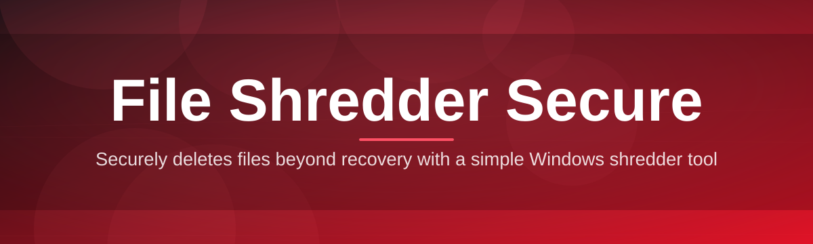
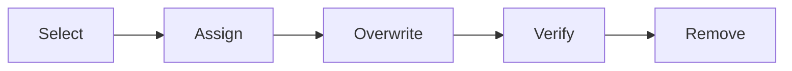

# file-shredder-utility 🛡️🔥

  

*Delete like you mean it — permanent, verifiable, and built for people who can't afford "maybe."*

  

## 📖 Overview

**file-shredder-utility** is a Windows-native secure deletion tool built around one uncompromising idea: when a file is gone, it should actually be gone. Standard deletion — even after emptying the Recycle Bin — leaves file remnants sitting on disk, recoverable with widely available tools. File Shredder Secure closes that gap by overwriting file data using industry-recognized sanitization patterns before removing the file's directory entry, so what's deleted stays deleted.

This project exists because "delete" and "destroy" are not the same verb, and enterprises, IT administrators, legal teams, and privacy-conscious individuals increasingly need the latter. Whether you're decommissioning a workstation, clearing sensitive client files before an audit, or simply maintaining good data hygiene on a shared machine, file-shredder-utility gives you a dependable, auditable way to erase data with confidence rather than hope.

It's built for a wide range of users: system administrators managing fleets of Windows machines, small businesses handling regulated data, freelancers who work with NDAs, and anyone who has ever winced after dragging a sensitive file to the Recycle Bin. No accounts, no cloud sync, no telemetry games — just a focused utility that does one job extremely well.

  

## 🚀 The Headline Feature: Verified Multi-Pass Overwrite

Before anything else, let's talk about the feature people ask about first: **verified multi-pass overwriting**. Instead of trusting a single overwrite pass and walking away, file-shredder-utility runs configurable multi-pass overwrite cycles — writing patterned data across the file's sectors and then performing a post-write verification read to confirm the overwrite actually landed. This isn't a spinner that lies to you; it's a shredder that checks its own work.

> [!NOTE]
> Multi-pass overwriting takes longer than a single pass, but for sensitive files — tax records, client contracts, credentials exports — that extra time is the whole point.

Beyond the headline capability, here's the full toolkit:

- **Drag-and-drop shredding** — drop files or entire folders straight onto the window; no navigating nested "Open File" dialogs when you're in a hurry.

- **Free space wiping** — sanitizes previously deleted data still lingering in unallocated disk space, catching remnants from files deleted before you ever installed this tool.

- **Context menu integration** — right-click any file in Windows Explorer and shred it directly, skipping the app window entirely for quick one-off jobs.

- **Batch queueing** — line up dozens or hundreds of files and folders, then let the shredder work through the queue unattended while you do something else.

- **Custom overwrite patterns** — choose from preset sanitization schemes or define your own byte pattern for specialized compliance needs.

- **Shred logs & reports** — every completed job generates a timestamped local log, useful for internal audit trails without any data leaving your machine.

- **Portable mode** — run it from a USB drive on machines where you don't want to leave an installed footprint.

- **Scheduled shredding** — queue a folder (like a Downloads or Temp directory) for automatic periodic sanitization.

## 🧭 Getting Off the Ground

1. Visit the project landing page using the download button above.

2. Download the latest Windows build — no account or sign-up required.

3. Run the executable; Windows SmartScreen may prompt on first launch since this is an independently distributed tool — choose "Run anyway" if you trust the source.

4. Drag in your first file, pick an overwrite scheme, and press Shred.

> [!TIP]
> Start with the "Standard" overwrite preset for everyday use. Reserve the higher pass-count presets for genuinely sensitive material — they're slower by design.

## 💻 System Requirements

| Requirement | Details |
|---|---|
| OS | Windows 10 (64-bit) or Windows 11 |
| Dependencies | None — fully standalone binary |
| Disk space | ~40 MB for the application itself |
| Permissions | Administrator rights recommended for system-level free space wiping |
| Internet | Not required after download |

  

## ⚙️ How It Works

The shredding pipeline is intentionally simple to reason about, which is exactly what you want from software that destroys data irreversibly:

1. **Selection** — you choose files, folders, or free space via drag-and-drop, context menu, or the queue.

2. **Pattern assignment** — the app maps your chosen overwrite preset (or custom pattern) to each queued item.

3. **Overwrite execution** — data is overwritten pass by pass according to the assigned pattern.

4. **Verification** — a read-back pass confirms the overwrite was written correctly to disk.

5. **Entry removal & logging** — the file's directory entry is removed and the job is recorded in the local shred log.

> [!IMPORTANT]
> Verification confirms the overwrite pattern was written — it does not "undo" the shred. Once a job reaches the Remove stage, the file is unrecoverable through normal means. Select carefully.

## 🩺 Troubleshooting

**Q: My antivirus flagged the executable — is that expected?**
Some heuristic engines flag low-level disk-writing utilities because the behavior resembles destructive tools generically. This is a known false-positive category for secure deletion software; verify you downloaded from the official landing page and submit the file to your AV vendor if concerned.

**Q: A shredded file still shows in a third-party recovery tool's scan results — why?**
Recovery tools often list orphaned directory entries or filenames even after underlying data has been overwritten. Attempting to actually recover the file's contents from those entries should fail once the overwrite has completed successfully.

**Q: Free space wiping is taking a very long time — is it stuck?**
Free space wiping scales with drive size and available capacity, not file count. On large mechanical drives this can take hours; check the progress log for continued activity before assuming it's frozen.

**Q: Can I shred a file that's currently open in another program?**
No — Windows file locks prevent overwriting a file that's in use. Close the file in any other application first, then retry.

**Q: Does shredding work on SSDs the same way as HDDs?**
Wear-leveling on SSDs means a logical overwrite doesn't always hit the exact same physical cells as the original write. file-shredder-utility performs the overwrite and verification at the OS level; for maximum assurance on SSDs, pair shredding with full-disk encryption from the start.

> [!WARNING]
> No secure deletion tool — this one included — can guarantee data is unrecoverable on every possible storage medium under every circumstance. Treat this as a strong layer of defense, not an absolute guarantee.

## 🎨 UI / UX Details

The interface favors keyboard-driven speed for power users while staying approachable for occasional use. Themes include Light, Dark, and a high-contrast mode for accessibility.

<strong>⌨️ Keyboard Shortcuts Reference</strong>

| Shortcut | Action |
|---|---|
| `Ctrl + O` | Open file/folder selector |
| `Ctrl + Shift + O` | Add folder to queue |
| `Del` | Remove selected item from queue |
| `Enter` | Start shredding queue |
| `Esc` | Cancel active job |
| `Ctrl + L` | Open shred log |
| `Ctrl + ,` | Open settings |
| `Ctrl + Shift + F` | Launch free space wipe |
| `F1` | Open help panel |
| `Ctrl + Q` | Quit application |

Settings persist locally and include overwrite pass count, default pattern, theme, logging verbosity, and whether context-menu integration is enabled.

## 🤝 Contributing & Community

Contributions, bug reports, and feature requests are welcome via the repository's Issues and Pull Requests. Before submitting a PR:

- Open an issue describing the change or bug first, especially for anything touching the overwrite engine.

- Keep pull requests focused — one fix or feature per PR makes review faster.

- Include reproduction steps for bug reports; disk-level behavior can be environment-specific.

> [!TIP]
> Documentation improvements, translation help, and UI polish are just as valuable as engine-level contributions — all skill levels welcome.

---

## 📄 License

Released under the [MIT License](LICENSE), 2026. Use it, adapt it, ship it — just carry the license forward.

## ⚠️ Disclaimer

This software is provided "as is," without warranty of any kind. Secure deletion reduces the practical likelihood of data recovery but cannot guarantee absolute irrecoverability across all hardware, filesystems, and future forensic techniques. Users are responsible for verifying that this tool meets their own compliance, legal, or organizational requirements before relying on it for sensitive data destruction.

  

